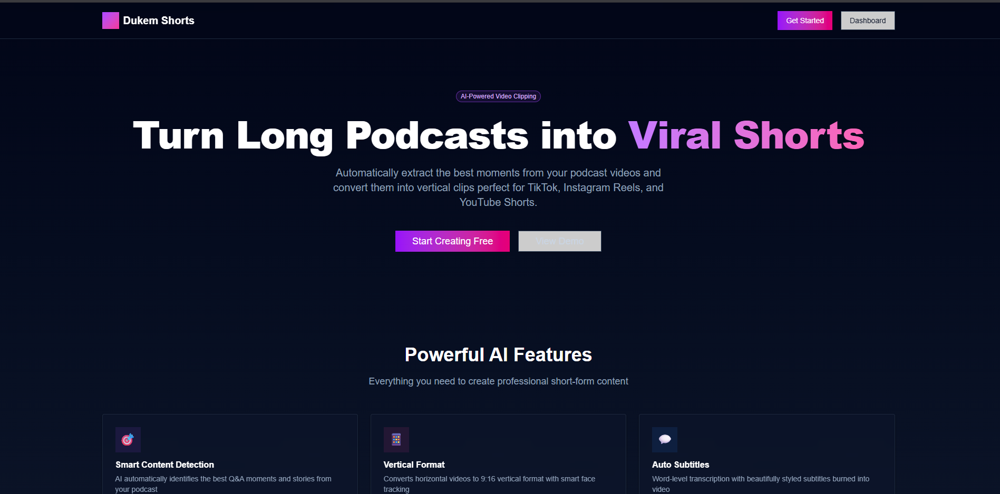
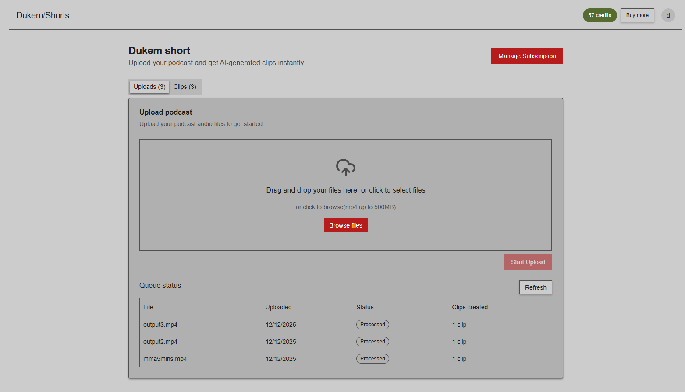
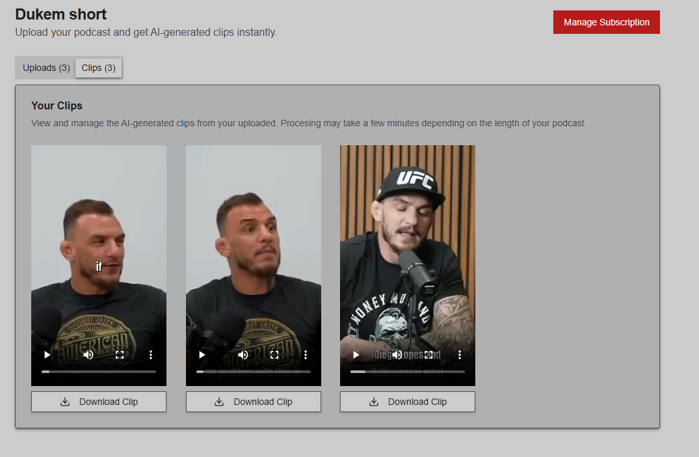
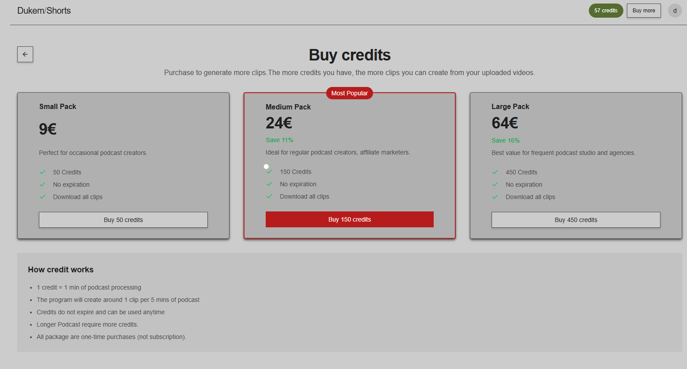

# AI Podcast Clipper

Transform long-form podcast videos into engaging vertical short-form clips optimized for TikTok and Instagram. This hybrid application leverages AI to automatically identify compelling moments, track speakers, and generate perfectly formatted 9:16 vertical videos with synchronized subtitles.

## Live Demo
[Live Demo Link](https://ai-podcast-clipper-iota.vercel.app/)

## Screenshot
*landing page*

  
*dashboard with uploaded video and generated clips*




*stripe payment modal*



## Overview

AI Podcast Clipper is a full-stack solution combining a Next.js frontend with GPU-accelerated serverless Python backend. Upload a podcast video, and the system will:

- Transcribe speech with word-level timestamps using WhisperX
- Identify 30-60 second question-and-answer moments using Gemini AI
- Detect and track active speakers in each frame
- Crop videos to vertical format with intelligent face tracking
- Generate and burn-in styled subtitles with perfect synchronization

## Architecture

**Frontend**: Next.js 15 (T3 Stack) with TypeScript, Prisma, and NextAuth  
**Backend**: Modal.com serverless Python with GPU acceleration  
**Storage**: AWS S3 for video uploads and processed clips  
**Queue**: Inngest for reliable job orchestration

### Processing Pipeline

```
User Upload → S3 → Inngest Event → Modal Backend
                                        ↓
                    [Transcribe → Identify → Crop → Subtitle]
                                        ↓
                                       S3
                                        ↓
             Frontend polls S3 → Creates DB records → Deducts credits
```

## Features

### 🎯 AI-Powered Clip Detection
- Gemini 2.5 Flash identifies compelling Q&A moments
- Configurable clip duration (30-60 seconds)
- Avoids greetings, small talk, and non-content segments

### 🎥 Intelligent Video Processing
- Active speaker detection using LR-ASD model
- 30-frame sliding window for smooth face tracking
- Vertical 9:16 crop (1080x1920) with face centering
- Blurred background fallback when no active speaker detected

### 📝 Professional Subtitles
- Word-level timestamp accuracy from WhisperX
- Anton font, center-aligned for optimal readability
- Smart line breaking (5 words max per line)
- Gap filling to prevent subtitle flickering
- Automatic pause detection for natural breaks

### 💳 Credit System
- User-based credit deduction (1 credit per clip)
- Real-time status tracking (queued → processing → processed)
- Concurrent processing control (1 job per user)

## Tech Stack

### Frontend
- Next.js 15 (App Router)
- TypeScript
- Prisma 6 (SQLite)
- NextAuth for authentication
- Inngest for workflow orchestration
- Tailwind CSS + shadcn/ui
- AWS SDK for S3 operations

### Backend
- Modal.com (serverless GPU containers)
- Python 3.12
- WhisperX (transcription)
- Google Gemini API (clip identification)
- LR-ASD (active speaker detection)
- FFmpeg + OpenCV (video processing)
- pysubs2 (subtitle generation)

## Project Structure

```
ai-podcast-clipper/
├── frontend/
│   ├── src/
│   │   ├── app/              # Next.js App Router pages
│   │   ├── actions/          # Server actions (auth, generation, S3)
│   │   ├── components/       # React components
│   │   ├── inngest/          # Workflow functions
│   │   ├── server/           # Database and auth
│   │   └── env.js            # Type-safe environment variables
│   └── prisma/
│       └── schema.prisma     # Database schema
│
└── backend/
    ├── main.py               # Modal app and processing pipeline
    ├── requirements.txt      # Python dependencies
    └── LR-ASD/               # Active speaker detection model
```

## Getting Started

### Prerequisites

- Node.js 18+ and npm
- Python 3.12
- Modal account
- AWS account (S3 bucket)
- Google AI API key (Gemini)

### Frontend Setup

```bash
cd frontend
npm install

# Configure environment variables
cp .env.example .env

# Set up database
npm run db:push

# Start development server
npm run dev
```

Required environment variables:
```
DATABASE_URL="file:./db.sqlite"
NEXTAUTH_URL="http://localhost:3000"
NEXTAUTH_SECRET="your-secret"
PROCESS_VIDEO_ENDPOINT="your-modal-endpoint"
PROCESS_VIDEO_ENDPOINT_AUTH="your-bearer-token"
S3_BUCKET_NAME="your-bucket-name"
AWS_ACCESS_KEY_ID="your-key"
AWS_SECRET_ACCESS_KEY="your-secret"
AWS_REGION="us-east-1"
```

### Backend Setup

```bash
cd backend
pip install modal

# Authenticate with Modal
modal setup

# Create Modal secret with:
# - GEMINI_API_KEY
# - AUTH_TOKEN (for endpoint authentication)
# - AWS credentials (for S3 access)
modal secret create ai-podcast-clipper

# Deploy to Modal
modal deploy main.py

# Test locally
modal run main.py
```

### S3 Configuration

Create an S3 bucket with CORS enabled:

```json
[{
    "AllowedHeaders": ["Content-Type", "Content-Length", "Authorization"],
    "AllowedMethods": ["PUT", "GET"],
    "AllowedOrigins": ["*"],
    "ExposeHeaders": ["ETag"],
    "MaxAgeSeconds": 3600
}]
```

IAM policy for backend access:
```json
{
    "Version": "2012-10-17",
    "Statement": [
        {
            "Effect": "Allow",
            "Action": ["s3:ListBucket"],
            "Resource": ["arn:aws:s3:::your-bucket-name"]
        },
        {
            "Effect": "Allow",
            "Action": ["s3:GetObject", "s3:PutObject", "s3:DeleteObject"],
            "Resource": ["arn:aws:s3:::your-bucket-name/*"]
        }
    ]
}
```

## Usage

1. Sign up and log in to the application
2. Navigate to the dashboard
3. Upload a podcast video (MP4 format recommended)
4. Wait for processing (typically 5-10 minutes for a 30-minute video)
5. Download generated clips from your dashboard

## GPU Requirements

**Critical**: Use L40S or A10G GPUs in Modal. These GPUs include NVENC hardware encoding required by `ffmpegcv.VideoWriterNV`. Do not use H100 GPUs as they lack NVENC and will cause encoding failures.

## Development

### Frontend Commands

```bash
npm run dev          # Start dev server + Inngest dev server
npm run db:push      # Sync Prisma schema to database
npm run db:generate  # Regenerate Prisma client
npm run build        # Production build
```

### Backend Commands

```bash
modal run main.py     # Local test with hardcoded S3 key
modal deploy main.py  # Deploy to production
modal app logs        # View production logs
```

### Inngest Dashboard

Access at `http://localhost:3000/x/inngest` during development to monitor workflow execution.


## Contributing

Contributions are welcome! Please ensure:
- TypeScript code passes type checking (`npm run typecheck`)
- Python code follows PEP 8 style guidelines
- New features include appropriate error handling
- GPU-intensive operations are optimized for cost

## License

MIT License - see LICENSE file for details

## Acknowledgments

- WhisperX for accurate speech transcription
- LR-ASD project for active speaker detection
- Modal.com for serverless GPU infrastructure
- T3 Stack for the excellent Next.js foundation
